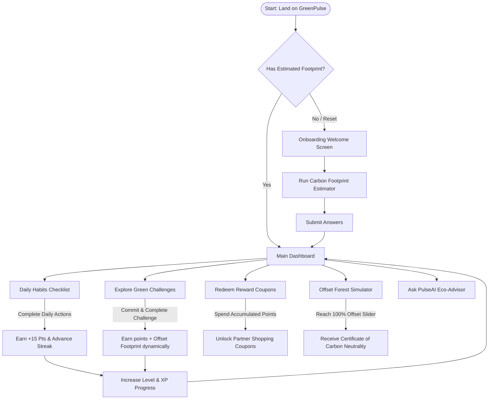
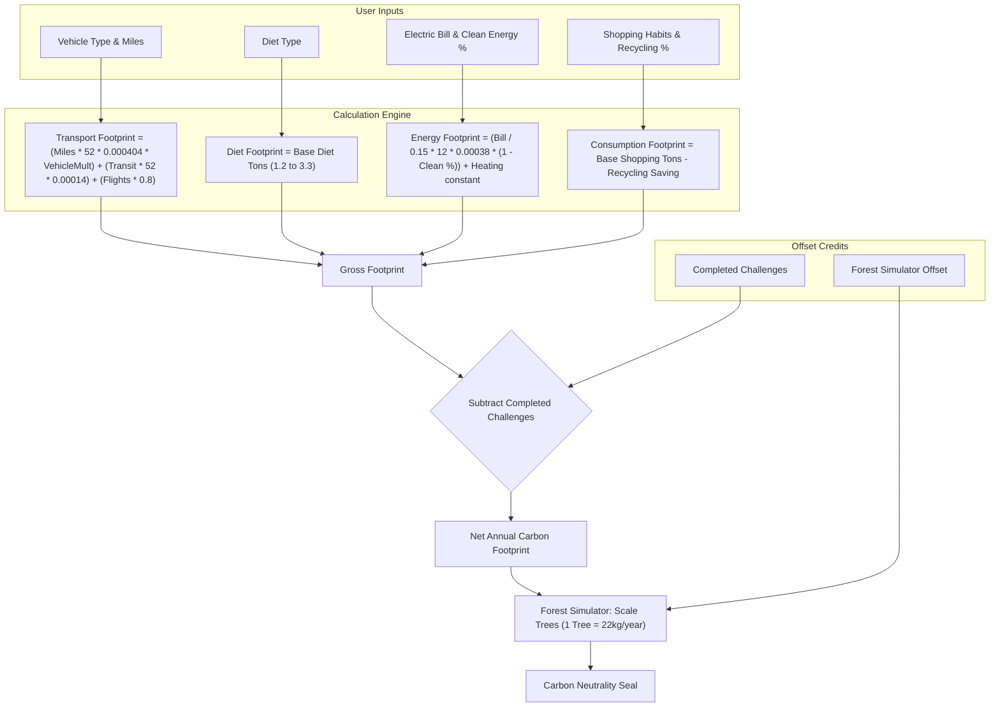

# 🌿 GreenPulse

[](https://react.dev/)
[](https://www.typescriptlang.org/)
[](https://vite.dev/)
[](https://opensource.org/licenses/MIT)

**GreenPulse** is a premium, interactive web application designed to help individuals calculate, track, and offset their personal carbon footprint. Combining game design mechanics with real-world botanical data and artificial intelligence, GreenPulse turns climate action into an engaging daily routine.

---

## ✨ Features

- **📊 Dynamic Carbon Estimator**: An interactive multi-category calculator evaluating transportation, dietary habits, home energy bills, and consumption rates.
- **⚡ Gamified Dashboard**: Track your daily eco-habits with a checklist, build streaks, level up (from *Carbon Onboarder* to *Carbon Neutral Hero*), and watch your XP grow.
- **🌱 Carbon-Saving Challenges**: Commit to and complete sustainability challenges (e.g., *Car-Free Commute*, *Plant-Based Weekdays*) that dynamically reduce your computed carbon score.
- **🎫 Green Rewards Shop**: Redeem points earned from daily streaks and challenges for coupons/discounts from sustainable brand partners.
- **🌲 Botanical Forest Simulator**: Visualize the exact number of trees needed to offset your carbon footprint, simulate costs, and earn a downloadable *Certificate of Carbon Neutrality*.
- **🤖 PulseAI Advisor**: A built-in chatbot offering instant, expert advice on home energy saving, composting, diet swaps, and green transport options.

---

## 🗺️ Application Architecture

The following flowcharts detail how GreenPulse handles the user journey and processes carbon calculations:

### 1. User Journey & Core Flow



### 2. Carbon Footprint & Points Calculation Model



---

## 🧮 Botanical & Environmental Constants

GreenPulse calculates your carbon impact using standardized environmental parameters:

| Variable | Source Metrics | CO₂ / Unit Equivalents |
| :--- | :--- | :--- |
| **Gasoline Car** | EPA Emissions Factor | `0.404 kg CO₂` per mile |
| **Hybrid Car** | Eco-efficiency factor | `0.202 kg CO₂` per mile (50% reduction) |
| **Electric Car** | Grid charging average | `0.061 kg CO₂` per mile (85% reduction) |
| **Public Transit** | Passenger average | `0.140 kg CO₂` per passenger-mile |
| **Flight** | Average round-trip flight | `0.800 metric tons CO₂` per flight |
| **Diet (High Meat)** | Average annual dietary CO₂ | `3.300 metric tons CO₂` per year |
| **Diet (Vegan)** | Plant-based dietary CO₂ | `1.200 metric tons CO₂` per year |
| **Electricity** | Average electrical grid CO₂ | `0.380 kg CO₂` per kWh |
| **Forest Offset** | Standard tree absorption capacity | `22.000 kg CO₂` absorbed per tree / year |

---

## 🛠️ Tech Stack

- **Frontend Core**: React 19, TypeScript 6.0, Vite 8.0
- **Iconography**: Lucide React
- **Design System**: Vanilla CSS Glassmorphism (Vibrant overlays, blurred container backdrops, dark-mode friendly HSL-customizable palettes)
- **Deployment**: Docker containerization, Google Cloud Run integration, Firebase Hosting options

---

## 🚀 Getting Started

### Prerequisites

Ensure you have [Node.js](https://nodejs.org/) (v18 or higher) and [npm](https://www.npmjs.com/) installed.

### Installation

1. Clone the repository:
   ```bash
   git clone https://github.com/devarkarrenika-pixel/GreenPulse.git
   cd GreenPulse
   ```

2. Install dependencies:
   ```bash
   npm install
   ```

3. Run the development server:
   ```bash
   npm run dev
   ```
   Open your browser and navigate to `http://localhost:5173` (or the port specified by Vite).

4. Build the application for production:
   ```bash
   npm run build
   ```

---

## 📦 Deployment Configuration

### Docker Execution
To run GreenPulse inside a container locally:
```bash
docker build -t greenpulse-app .
docker run -p 8080:8080 greenpulse-app
```

### CI/CD Deployment
This repository is configured with a GitHub Actions workflow (`.github/workflows/deploy.yml`) that automatically builds and deploys your changes to **Google Cloud Run** on every push to the `main` branch. 

To enable this:
1. Set up a GCP Service Account with permissions for Artifact Registry and Cloud Run.
2. Add your GCP Service Account credentials JSON key as a secret named `GCP_SA_KEY` in your GitHub repository secrets.
3. Update the `PROJECT_ID` inside `.github/workflows/deploy.yml` with your actual GCP Project ID.

---

## 📄 License

This project is licensed under the MIT License - see the [LICENSE](LICENSE) file for details.
